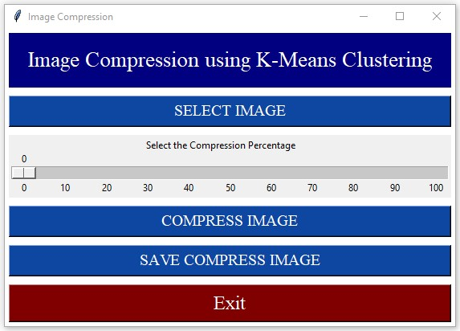

# Image-Compression-GUI
In this project i have applied the K-means clustering algorithm which is an unsupervised learning algorithm using scikit-learn and Python 3.7 to build an image compression application with interactive GUI.

# APPROACH
I used K-Means, a Machine Learning clustering algorithm, to cluster all the colors in an image into 16 clusters and replace the RGB value of every pixel with the RGB value of their respective cluster center and thus reducing the amount of memory required to save a picture.

# Python Libraries Required
*	Pillow – It is an image processing library.
*	Numpy – It is the fundamental package for array computing with Python.
*	OpenCv – It is used for computer vision, machine learning, and image processing
*	Tkinter – It is the standard GUI library for Python.
*	Scikit-image – It is a free machine learning library for Python.

# GUI Preview

# K-MEANS ON IMAGE COMPRESSION
Suppose the image that we’ll be compressing is of 396 x 396 x 3. Therefore, for each pixel location we would have three 8-bit integers that specify the red, green, and blue intensity values. 
Our goal is to reduce the number of colors to 30 and represent (compress) the photo using those 30 colors only. To pick which colors to use, we’ll use k-means algorithm on the image and treat every pixel as a data point. That means reshape the image from height x width x channels to (height * width) x channel, i.e. we would have 396 x 396 = 156,816 data points in 3-dimensional space which are the intensity of RGB. Doing so will allow us to represent the image using the 30 centroids for each pixel and would significantly reduce the size of the image by a factor of 6. The original image size was 396 x 396 x 24 = 3,763,584 bits; however, the new compressed image would be 30 x 24 + 396 x 396 x 4 = 627,984 bits.

The huge difference comes from the fact that we’ll be using centroids as a lookup for pixels’ colors and that would reduce the size of each pixel location to 4-bit instead of 8-bit.

# CONCLUSION
We can see the comparison between the original image and the compressed one. The compressed image looks close to the original one which means we’re able to retain the majority of the characteristics of the original image. With smaller number of clusters we would have higher compression rate at the expense of image quality. 
